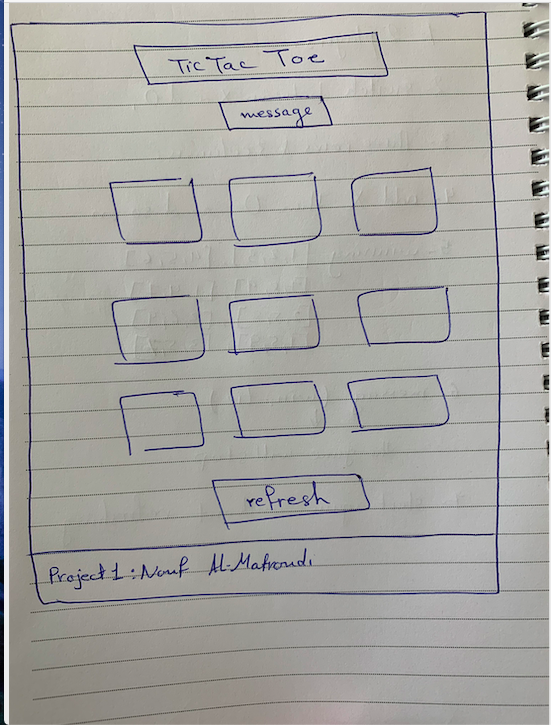

# Project 1 :

----
## what a technologies i use?
     HTML , CSS , JavaScript ;

----
## My wireframes 

----
## My Project link
 [Tic Tac Toe]( https://nouf1.github.io/projectTec/)
----
## User Stories
1. As a user, I should be able to start a new tic tac toe game
2. As a user, I should be able to click on a square to add X first and then O, and so on
3. As a user, I should be shown a message after each turn for if I win, lose, tie or who's turn it is next
4. As a user, I should not be able to click the same square twice
5. As a user, I should be shown a message when I win, lose or tie
6. As a user, I should not be able to continue playing once I win, lose, or tie
7. As a user, I should be able to play the game again without refreshing the page

----
## The unsolved problems which i would be fixed in future iterations:

the basic requirement i finish from them , but the Potential Extra Tic Tac Toe there some i didn't solve . 

* Keep track of multiple game rounds with a win, lose and tie counter
* Allow players to customize their tokens (X, O, name, picture, etc)
* Use localStorage to persist data locally to allow games to continue after page refresh or loss of internet connectivity
* Create an AI opponent: teach JavaScript to play an unbeatable game against you

----
## How i solved the winner

* I make an array for all the possible cases for winning
* I make two loops to check the array
* If there is matching it will be winning otherwise the result will be tie 

----
## My favorite functions
>checkWinning function is my favorite

* I make an array for all the possible cases for winning

* I make two loops to check the array

* If there is matching it will be winning otherwise the result will be tie 
